# 11 — Knowledge Graph of Mathematical Discovery

A bipartite directed graph that re-expresses the canonical theorems of modern mathematics — chapters 01–07 of this book **plus** the 13-domain expansion of iter-3 — as a **single knowledge structure**: states (mathematical objects) flow through techniques (processes) to produce new states, and eventually theorems (leaves). Techniques that serve many proofs — reduce-to-canonical-form, compactness, compose-with-identity, axiomatize-from-instances, conserved quantity, structural isomorphism — appear as high-fan-in/fan-out hubs. Compound techniques (Fourier, SVD, Galois correspondence, Ricci flow with surgery, Wiles modularity, Gödel numbering, Atiyah–Singer, sieve/circle methods, Furstenberg correspondence, category-theoretic colimits/adjoints, deformation cohomology) are further elaborated as **subgraphs** whose internal bipartite structure shows how they are themselves built.

**Current size (after iter 3):** 6225 nodes (1571 axioms + 2925 states + 1667 theorems + 62 techniques), 10556 edges, 12 subgraphs. Giant connected component covers 99.90 % of the graph (6219 nodes; only 5 isolated nodes remain, all pre-iter-3 axioms).

Built across three iterations:
- **Iter 1** (commit `c7b5f99`): 63 landmark derivation chains covering 65 deep-dive theorems across chapters 01–06. Philosopher flagged 26 structural concerns (17 applied in place).
- **Iter 2** (commit `aa5b27f`): +42 deep-dive chains completing chapters 01–06 + 229 brief-catalog skeletons from chapter 07. Philosopher Round-5 audit applied 10 additional critical corrections.
- **Iter 3** (commit `TBD`): **+1331 new theorem nodes** from a 13-domain web-sourced sweep (Number Theory, Algebra, Analysis (incl. AN2 supplement), Functional Analysis, Topology, Geometry, Combinatorics, Logic, Probability, ODE/PDE, Dynamical Systems, Mathematical Physics, Discrete Math/TCS). Each entry has a full 3–6-step chain through the frozen 62-technique toolbox. 1595 chains drafted across 14 parallel subagent invocations; ~264 dedupe-skipped against iter-2 entries; 1331 integrated. 2001 context-axiom edges added in a Type-A orphan-fix pass to wire chain-preamble axioms into step-1 techniques. Seven minor `⚠ needs new technique` notes (Cauchy-MVT-application, Baire-category-application, Lebesgue-number-lemma-application, Carleson tile-decomp, Lebesgue-density-application, Hadamard canonical-product, Vitushkin localization — all subordinate uses of existing techniques) deferred to a future toolbox-cleanup round.

Intermediate artefacts live in `knowledge_graph_workspace/` (iter 1), `knowledge_graph_workspace_iter2/` (iter 2), and `knowledge_graph_workspace_iter3/` (iter 3). The machine-readable form lives at `knowledge_graph.json` (~3.0 MB).

---

## §0 How to read this file

Fast path (you just want the graph): skim §2 for the top-level Mermaid, then pick a compound technique from §3 and read its subgraph, then pick a landmark theorem from §4 and trace its path.

Complete path: §1 schema → §2 top-level → §3 subgraphs → §4 paths → §5 stats → §6 (what we fixed during review) → §7 (what is still missing) → §8 (how to extend).

The graph is **bipartite and directed**:

- Edges go **state → technique** (input) or **technique → state** (output). Never state→state. Never technique→technique at the top level.
- Every **theorem** is a terminal `kind: theorem` state node.
- Every **axiom / starting object** is a source `kind: axiom` state node.
- Everything else is `kind: state`.

---

## §1 Graph schema

### 1.1 Node types

**State node**
```yaml
id: s_<snake_case>
kind: state | theorem | axiom
name: <display name>
type_signature: <type in one short phrase>
description: <one sentence>
aliases: [<other ids that mean the same thing>]
```

**Technique node**
```yaml
id: t_<snake_case>
kind: technique
name: <display name>
cluster: <C1..C12 from 10_toolbox.md>
function_signature: <inputs → outputs>
parameters: [<names of dials that vary per use>]
has_subgraph: true | false
subgraph_ref: sg_<name>
toolbox_ref: 10_toolbox.md#<section>
provisional: true   # only for nodes not yet in toolbox
single_use_landmark: true   # only for fan-in + fan-out < 4
meta_technique: true   # for sociological / computational-process nodes
```

**Edge**
```yaml
from: <node id>
to: <node id>
role: input | output
parameter_binding: {<name>: <value>, ...}   # e.g. {axis: columns, over: ℝ, direction: forward}
used_in_theorem: <theorem state node id>
```

### 1.2 Parameters live on edges, not nodes

Technique nodes are **application-site-invariant**. The dimensions, axes, fields, and domains that distinguish concrete uses go on edges:

- Same node `t_svd_and_spectral_decomposition` appears for SVD-along-rows and SVD-along-columns; the difference lives in the edge's `parameter_binding: {axis: ...}`.
- Same node `t_fourier_transform` covers continuous, discrete, and finite-group variants; edges carry `{domain: ℝ | 𝕋 | finite abelian group, direction: forward | inverse}`.
- Same node `t_reduce_to_canonical_form` covers Jordan form, depressed cubic, triangulation-of-surface, Bezout normalization of coprime pair; edges carry the specific substitution.

Create a separate technique node only when the **underlying mathematics is structurally different**, not when only parameters differ.

### 1.3 Subgraphs

A compound technique (Fourier, SVD, Galois correspondence, Ricci flow with surgery, …) is represented **twice**:

1. A single top-level technique node (so a theorem can cite it as an atomic arrow).
2. A subgraph — internal bipartite state/technique graph — showing the sub-steps.

Cross-references across subgraphs are allowed and expected: `t_orthogonal_projection_onto_basis` appears in both `sg_fourier` and `sg_svd`.

### 1.4 Coherence rules

Every proposed node/edge must pass:

1. **Typed correctness** — technique's input types match the state-node types feeding it.
2. **Direction meaningfulness** — reversing the edge is either (a) a different technique that should also be in the graph, or (b) meaningless. If it is the same technique "run backward", record `direction: forward | inverse` as a parameter — do not create a second node. (Fourier forward/inverse are one node. SVD and its inverse reconstruction are one node — correcting earlier schema draft.)
3. **Reusability** — a technique node must describe something more general than a single theorem's step, unless explicitly flagged `single_use_landmark: true`.
4. **Non-redundancy** — two technique nodes at the same abstraction level describing the same process get merged.

---

## §2 Top-level graph

Because a 350-node bipartite diagram is unreadable, the top-level view is a **supernode** aggregation: one box per toolbox cluster (showing its 3–5 highest-fan-in techniques), one box per era (grouping its theorems), and arrows from era-supernodes into the techniques those theorems most use.

Numbers in parentheses are total fan-in + fan-out for that technique. An asterisk `*` marks compound techniques elaborated as subgraphs in §3.

```mermaid
flowchart LR
  subgraph C1["Cluster 1 · Experimental"]
    T_spot["t_spot_pattern_in_table"]
    T_verify["t_verify_on_special_cases"]
    T_refine["t_conjecture_refinement †"]
  end
  subgraph C2["Cluster 2 · Algebraic Manipulation"]
    T_compose["t_compose_with_identity (reduced: only identity-closure) (15)"]
    T_aux["t_auxiliary_construction † (new, was part of t_compose_with_identity)"]
    T_canonical["t_reduce_to_canonical_form (23)"]
    T_square["t_complete_the_square"]
    T_svd["t_svd_and_spectral_decomposition * †"]
  end
  subgraph C3["Cluster 3 · Symmetry & Invariants"]
    T_symm["t_symmetry_reduction (17)"]
    T_conserve["t_conserved_quantity (21)"]
    T_dual["t_duality (10)"]
    T_char["t_character_decomposition_count"]
  end
  subgraph C4["Cluster 4 · Approximation & Limits"]
    T_exhaust["t_exhaustion_squeeze"]
    T_interp["t_interpolate_and_continue"]
    T_freq["t_frequency_decomposition (17)"]
    T_fourier["t_fourier_transform *"]
  end
  subgraph C5["Cluster 5 · Abstraction"]
    T_axiom["t_axiomatize_from_instances"]
    T_isom["t_structural_isomorphism (13)"]
    T_ultra["t_ultraproduct_transfer"]
    T_galois["t_galois_correspondence *"]
  end
  subgraph C6["Cluster 6 · Topology & Obstruction"]
    T_raise["t_raise_dimension"]
    T_proj["t_projection_to_subspace †"]
    T_obstr["t_obstruction_class (17)"]
    T_compact["t_compactness_argument (14)"]
    T_def["t_deformation_cohomology *"]
    T_rescale["t_rescale_for_asymptotic_geometry"]
    T_wiles["t_wiles_modularity *"]
  end
  subgraph C7["Cluster 7 · Self-Reference"]
    T_diag["t_diagonalize"]
    T_arith["t_arithmetize_syntax"]
    T_force["t_force_independence"]
    T_reductio["t_reductio_ad_absurdum †"]
    T_godel["t_godel_numbering *"]
  end
  subgraph C8["Cluster 8 · Iteration & Fixed Points"]
    T_contract["t_contraction_fixed_point"]
    T_descent["t_infinite_descent (scope narrowed) (12)"]
    T_flow["t_flow_with_surgery"]
    T_ricci["t_ricci_flow_with_surgery *"]
  end
  subgraph C9["Cluster 9 · Cross-Field Transfer"]
    T_phys["t_physics_to_pde"]
    T_ca2int["t_complex_analysis_to_integers"]
    T_bridge["t_analysis_algebra_topology_bridge (split into 5) †"]
    T_major["t_major_minor_arc_decomposition"]
    T_ergodic["t_ergodic_correspondence"]
    T_circle["t_circle_method *"]
    T_furst["t_furstenberg_correspondence_principle *"]
  end
  subgraph C10["Cluster 10 · Computer & Collab"]
    T_case["t_finite_case_check"]
    T_formal["t_formal_verify"]
    T_distrib["t_distributed_collaboration (meta)"]
  end
  subgraph C11["Cluster 11 · Probabilistic & Counting"]
    T_prob["t_probabilistic_existence"]
    T_pigeon["t_pigeonhole_collision"]
    T_sieve["t_sieve_by_optimized_quadratic"]
    T_selberg["t_selberg_sieve_method *"]
    T_poly["t_polynomial_method"]
  end
  subgraph C12["Cluster 12 · Homological & Categorical"]
    T_k0["t_group_complete_exact_category"]
    T_sheaf["t_sheafify_on_grothendieck_topology"]
    T_rep["t_representable_functor_trick"]
    T_as["t_atiyah_singer_index_machinery *"]
    T_cat["t_category_theoretic_colimits_and_adjoints *"]
  end

  Era1["Ancient/Medieval<br/>Pythagoras, Thales, Euclid,<br/>Archimedes, Ptolemy, CRT,<br/>Chakravāla"]
  Era2["Renaissance/17c<br/>Cardano, Ferrari, Desargues,<br/>FermatLT, Fermat 2-sq, FTC,<br/>Kepler"]
  Era3["18c<br/>Taylor, De Moivre, Euler, Basel,<br/>Königsberg, FTA, Lagrange 4-sq,<br/>CLT, Quadratic Reciprocity"]
  Era4["19c<br/>Theor. Egregium, Gauss–Bonnet,<br/>Cauchy, Abel–Ruffini, Galois,<br/>Fourier, Stokes, Riemann Map/Roch,<br/>PNT, Sylow, Cantor, Weierstrass"]
  Era5["Early 20c<br/>Hilbert basis, Nullstellensatz,<br/>Brouwer, Noether, Gödel,<br/>Banach, Hahn–Banach, Tychonoff,<br/>Halting, L, Ramsey, Birkhoff"]
  Era6["Modern<br/>Atiyah–Singer, CFSG, Cohen,<br/>4CT, Mordell–Faltings, FLT,<br/>Poincaré, Kepler (Hales),<br/>Green–Tao, Zhang, Helfgott,<br/>Robertson–Seymour, Szemerédi"]

  Era1 --> T_symm
  Era1 --> T_compose
  Era1 --> T_descent
  Era1 --> T_exhaust
  Era1 --> T_aux
  Era2 --> T_square
  Era2 --> T_canonical
  Era2 --> T_pigeon
  Era2 --> T_phys
  Era2 --> T_dual
  Era2 --> T_proj
  Era3 --> T_freq
  Era3 --> T_interp
  Era3 --> T_spot
  Era3 --> T_conserve
  Era3 --> T_char
  Era3 --> T_compact
  Era3 --> T_refine
  Era4 --> T_conserve
  Era4 --> T_compact
  Era4 --> T_dual
  Era4 --> T_obstr
  Era4 --> T_isom
  Era4 --> T_diag
  Era4 --> T_reductio
  Era4 --> T_fourier
  Era4 --> T_galois
  Era4 --> T_ca2int
  Era5 --> T_axiom
  Era5 --> T_ultra
  Era5 --> T_force
  Era5 --> T_arith
  Era5 --> T_godel
  Era5 --> T_contract
  Era5 --> T_reductio
  Era6 --> T_case
  Era6 --> T_formal
  Era6 --> T_distrib
  Era6 --> T_ricci
  Era6 --> T_wiles
  Era6 --> T_def
  Era6 --> T_bridge
  Era6 --> T_ergodic
  Era6 --> T_furst
  Era6 --> T_circle
  Era6 --> T_sieve
  Era6 --> T_selberg
  Era6 --> T_as
  Era6 --> T_rescale
```

(`†` marks nodes added or reframed in §6 following the philosopher's review. Earlier versions of this file had `t_compose_with_identity` doing the work of three distinct moves and `t_analysis_algebra_topology_bridge` collapsing five different bridges; both have been pulled apart.)

---

## §3 Subgraph elaborations

Each subgraph below shows a compound technique's internal bipartite graph. **Entry points** are states matching the parent node's inputs; **exit points** match the parent node's outputs.

### 3.1 Fourier transform — `sg_fourier`

Entry: `s_l2_function` (an L² function on a locally compact abelian group). Exit: `s_spectrum_on_dual_group`. The forward/inverse distinction is a parameter on the `t_orthogonal_projection_onto_basis` edge, not a second technique — overriding the earlier schema draft.

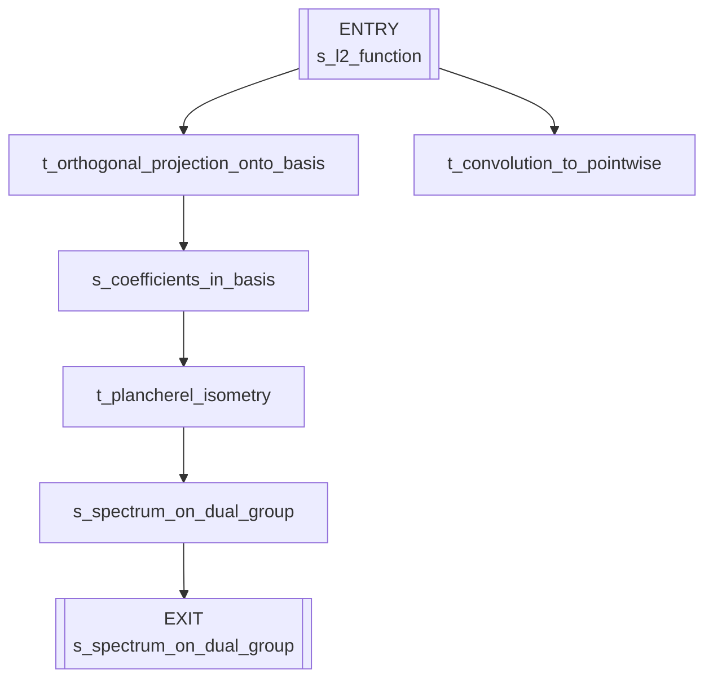

Used by: Fourier heat theorem, CLT (via characteristic function), PNT (implicitly via Dirichlet series), Atiyah–Singer (symbol extraction), ergodic theorem (spectral decomposition of Koopman operator), Gauss quadratic reciprocity (finite-abelian Fourier).

### 3.2 SVD / spectral decomposition — `sg_svd`

Entry: `s_linear_map` (T : V → W). Exits: `s_singular_value_spectrum`, `s_low_rank_approximation`. Added on the philosopher's recommendation: SVD was missing from the toolbox but has fan-in ≥ 5 across the corpus (Perron–Frobenius, PCA, spectral graph theory, Koopman, compressed sensing). Cluster-2 entry under canonical-form reduction.

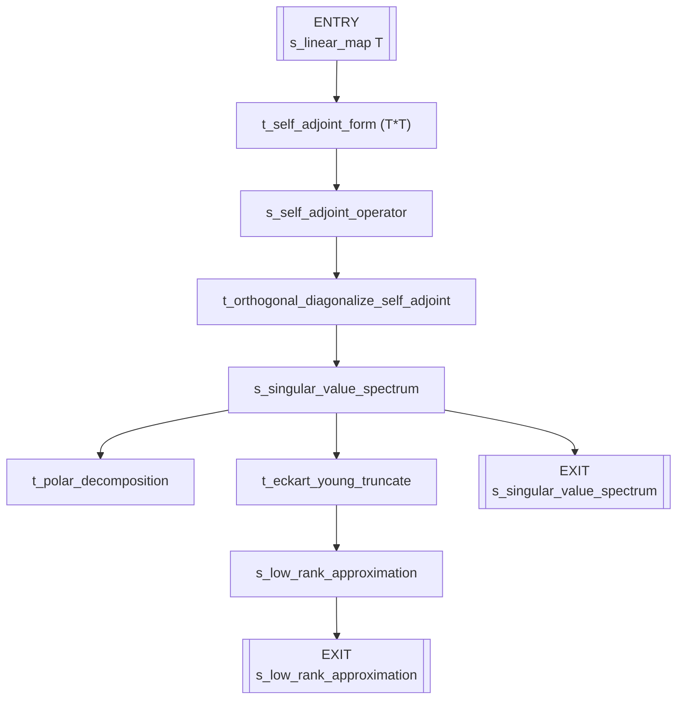

Inherits: `t_reduce_to_canonical_form` (SVD is a canonical-form reduction via orthogonal change of bases) and `t_frequency_decomposition` (orthonormal-basis projection sub-step).

### 3.3 Galois correspondence — `sg_galois`

Entry: `s_galois_extension_L_over_K`. Exit: `s_order_reversing_correspondence`.

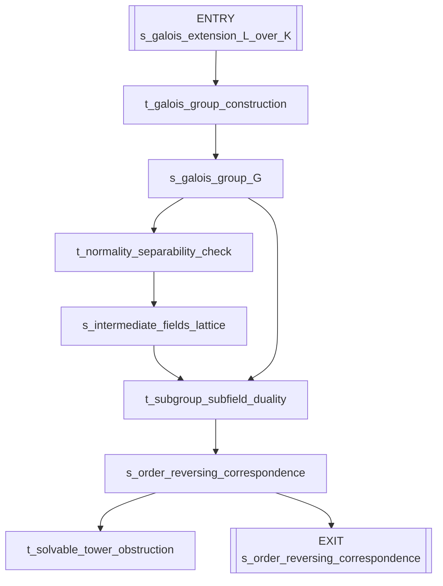

Used by: Galois fundamental theorem, Abel–Ruffini (quintic unsolvability), Kronecker–Weber, inverse Galois problem, class field theory (as blueprint).

### 3.4 Ricci flow with surgery — `sg_ricci_flow`

Entry: `s_riemannian_manifold` (M, g₀). Exit: `s_geometric_pieces`.

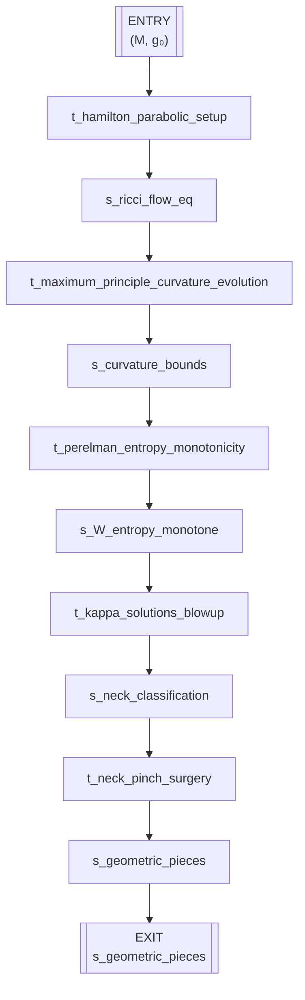

This subgraph absorbs the `t_perelman_entropy_package` that was separately flagged — entropy monotonicity is the middle of the pipeline, not a parallel technique. Used by: Poincaré conjecture (dim 3), Geometrization, partial results on Thurston's 8 geometries.

### 3.5 Wiles modularity — `sg_wiles_modularity`

Entry: `s_hypothetical_flt_solution`. Exit: `s_flt`. The sub-step `t_analysis_algebra_topology_bridge` that once collapsed this pipeline has been replaced by specific specializations (§6).

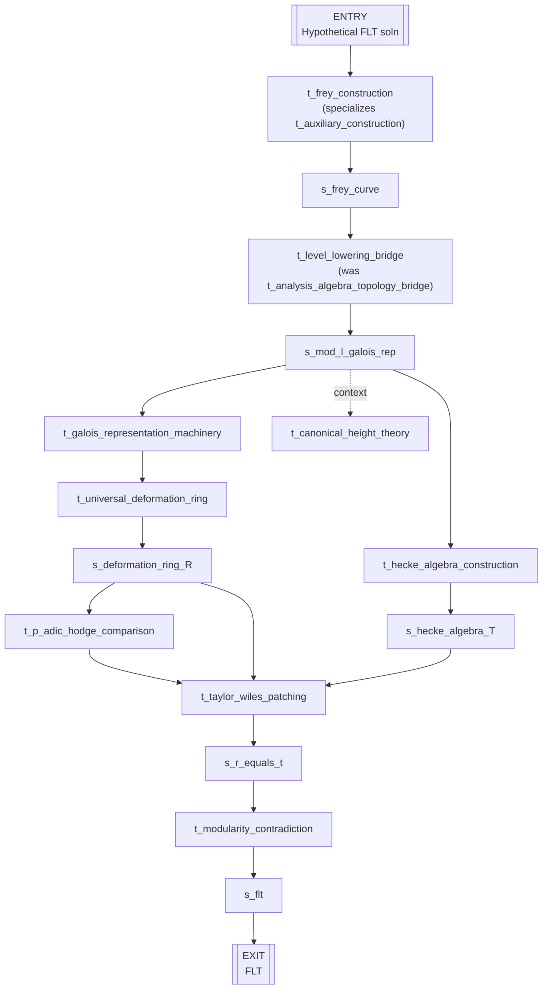

Used by: FLT, Sato–Tate, Serre's modularity conjecture, and (with level-lowering alone) Ribet's theorem.

### 3.6 Gödel numbering — `sg_godel_numbering`

Entry: `s_formal_system`. Exit: `s_self_referential_sentence`.

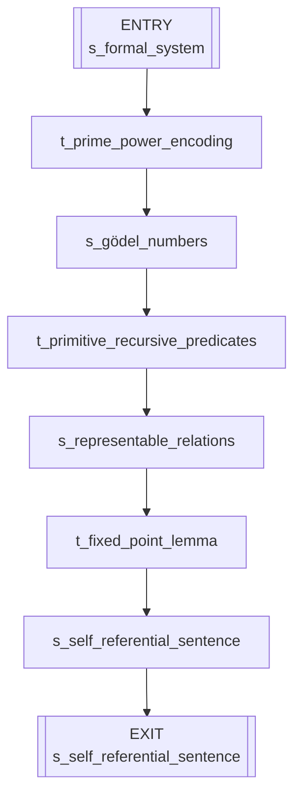

Used by: Gödel 1st & 2nd incompleteness, Turing halting (via diagonalization), Löb's theorem, Tarski undefinability of truth, Rosser's trick.

### 3.7 Atiyah–Singer index — `sg_atiyah_singer`

Entry: `s_elliptic_operator_D`. Exits: `s_topological_index`, `s_analytic_index`. The `t_index_equality` node fuses the two exits into the Atiyah–Singer theorem proper.

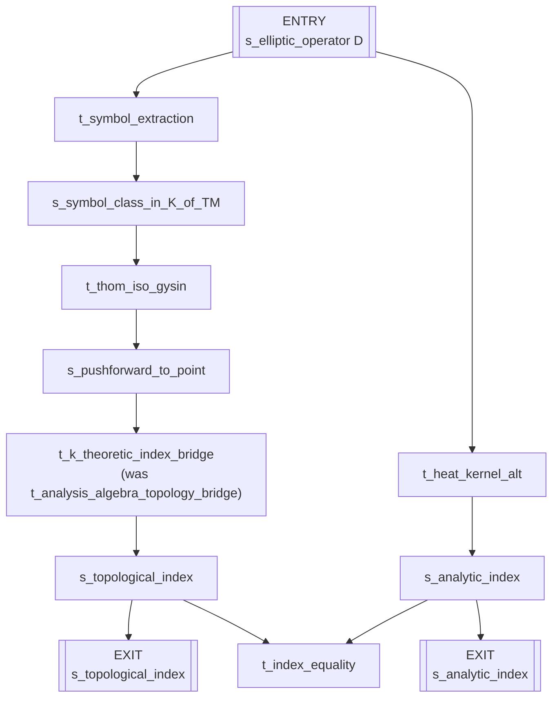

Used by: Gauss–Bonnet (as lowest-dimensional special case), Hirzebruch signature theorem, Riemann–Roch (alternative proof), families index theorem.

### 3.8 Selberg sieve — `sg_selberg_sieve`

Entry: `s_admissible_set`. Exit: `s_sieve_bound`.

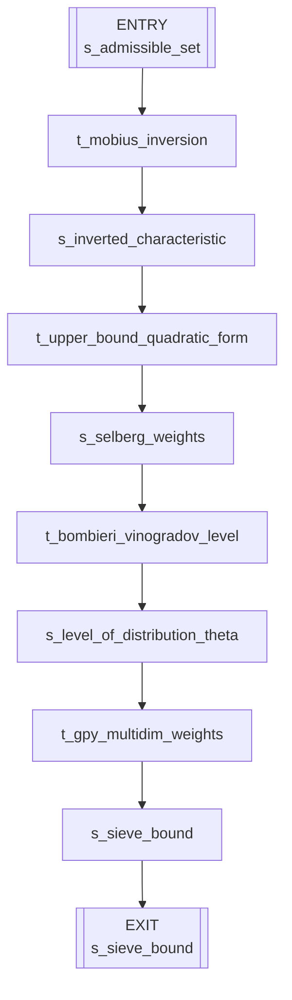

Used by: Selberg's own proof of a simple π(x) upper bound, Bombieri–Vinogradov, Zhang's bounded gaps, Maynard–Tao's small-gap improvement, Green–Tao (as one ingredient).

### 3.9 Circle method — `sg_circle_method`

Entry: `s_additive_problem` (e.g., r(N) = number of ways to write N as a sum of s primes). Exit: `s_final_asymptotic`.

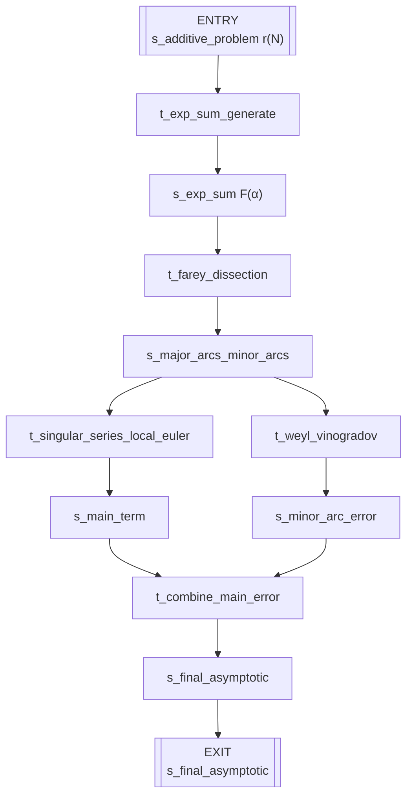

Used by: Waring's problem, Vinogradov three-primes theorem, Helfgott ternary Goldbach, various partition asymptotics.

### 3.10 Furstenberg correspondence — `sg_furstenberg_correspondence`

Entry: A ⊂ ℤ with positive density. Exit: `s_recurrence`.

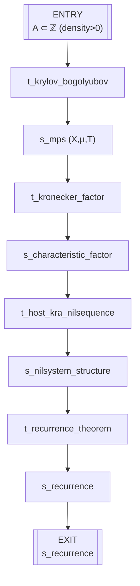

Used by: Szemerédi theorem (Furstenberg's ergodic proof), Green–Tao (via the `t_transference_bridge` specialization introduced in §6), Bergelson–Leibman polynomial Szemerédi.

### 3.11 Category-theoretic colimits & adjoints — `sg_category_colimits_adjoints`

Entry: `s_diagram_in_C`. Exits: colimit, adjoint pair, Kan extension.

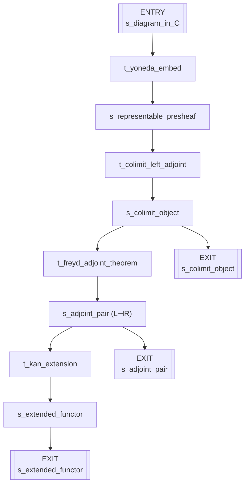

Flagged by the philosopher as **low-fan-in at top level** — it appears as a toolbox entry but no Part A chain used it directly. Retained here as a subgraph because the mechanism is load-bearing for Grothendieck's EGA / SGA program and for homotopy-theoretic applications. Marked `single_use_landmark: true` at the top level.

### 3.12 Deformation cohomology / R = T — `sg_deformation_r_equals_t`

Entry: `s_residual_representation ρ̄`. Exit: `s_r_equals_t`.

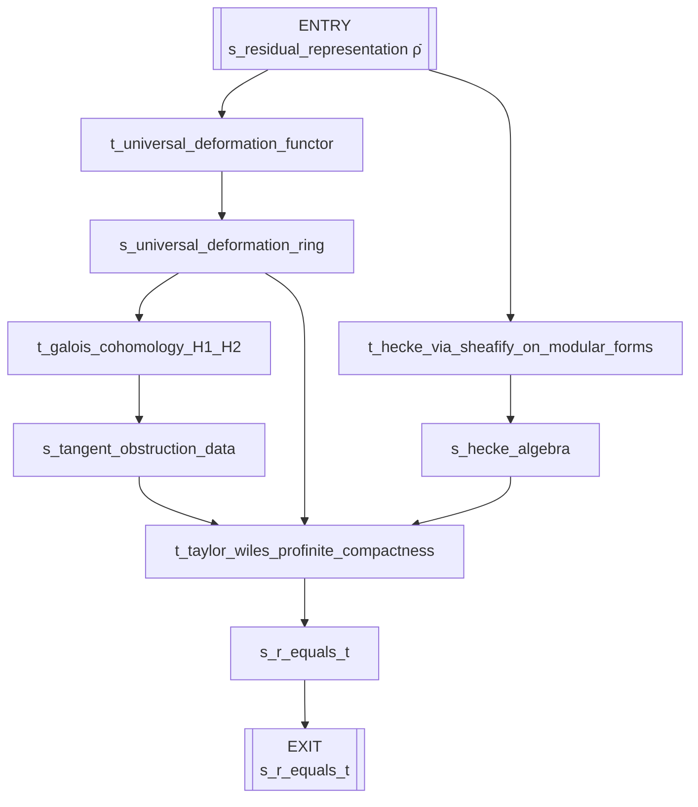

Used by: Wiles modularity (as engine), later generalizations by Breuil–Conrad–Diamond–Taylor, Kisin's modularity lifting, Khare–Wintenberger (Serre's conjecture), and the broader Langlands modularity-lifting program.

---

## §4 Landmark theorem derivation paths

Each line is a single traversal through the graph, from axiom/starting states to a terminal theorem. Multiple inputs at a technique are shown as `⟨a, b⟩`. Edge parameters are shown in `{braces}`.

```
Pythagoras:
  s_right_triangle_in_plane
  → t_symmetry_reduction {group: reflection across altitude}
  → s_two_similar_subtriangles
  → t_compose_with_identity {identity: similarity ratio² = area ratio}
  → s_segment_length_identity
  → t_complete_the_square
  → s_pythagorean_theorem

Infinitude of primes:
  s_finite_list_of_primes
  → t_auxiliary_construction {build: N = p₁⋯pₖ + 1}
  → s_new_number_coprime_to_all_primes
  → t_reductio_ad_absurdum
  → s_infinitude_of_primes

Archimedes (area of circle):
  s_circle
  → t_symmetry_reduction {group: O(2) rotation}
  → s_inscribed_circumscribed_96_gons
  → t_exhaustion_squeeze {lower: inscribed, upper: circumscribed}
  → s_area_of_circle

Cardano:
  s_general_cubic
  → t_reduce_to_canonical_form {substitution: x = t − b/3a}
  → s_depressed_cubic
  → t_complete_the_square {auxiliary: t = u + v, uv = −p/3}
  → s_system_sum_and_product_of_cubes
  → t_compose_with_identity {identity: u³, v³ satisfy a quadratic}
  → s_cardano_cubic_formula

Desargues (now corrected):
  s_two_triangles_in_perspective_in_plane
  → t_raise_dimension {2D → 3D}
  → s_two_triangles_in_perspective_in_space
  → t_duality {primal ↔ dual in projective 3-space}
  → s_axis_of_perspective
  → t_projection_to_subspace {3D → 2D}       # previously mislabelled t_symmetry_reduction
  → s_desargues_theorem

Fundamental Theorem of Algebra:
  s_complex_polynomial_p_z
  → t_raise_dimension {to two real algebraic curves in ℝ²}
  → s_two_real_algebraic_curves_in_plane
  → t_compactness_argument {large-circle bound}
  → s_intersection_exists
  → t_conserved_quantity {winding number around 0}
  → s_fundamental_theorem_of_algebra

Gauss–Bonnet:
  s_compact_oriented_surface_without_boundary
  → t_reduce_to_canonical_form {triangulate}
  → s_geodesic_triangulation
  → t_conserved_quantity {∫K dA triangulation-independent}
  → s_local_angle_defect_identity
  → t_compose_with_identity {sum over triangles with s_euler_polyhedron_formula}
  → s_gauss_bonnet_theorem

Galois fundamental theorem:
  s_finite_normal_separable_extension_L_over_K
  → t_axiomatize_from_instances
  → s_galois_group
  → t_duality {subgroups ↔ intermediate fields, order-reversing}
  → s_galois_correspondence
  → t_structural_isomorphism
  → s_fundamental_theorem_of_galois_theory

Fourier heat (1822):
  s_heat_conduction_on_rod
  → t_physics_to_pde
  → s_heat_equation_PDE
  → t_frequency_decomposition {basis: sin(nπx/L)}
  → s_mode_by_mode_ODE_system
  → t_contraction_fixed_point
  → s_fourier_theorem_heat

Prime Number Theorem:
  s_euler_product_zeta
  → t_interpolate_and_continue {analytic continuation to ℂ \ {1}}
  → s_meromorphic_zeta_on_plane
  → t_obstruction_class {ζ non-vanishing on Re s = 1}
  → s_zeta_nonvanishing_on_line
  → t_complex_analysis_to_integers {Perron-style contour}
  → s_prime_number_theorem

Gödel first incompleteness:
  s_first_order_peano_arithmetic
  → t_arithmetize_syntax
  → s_syntactic_predicates_as_arithmetic
  → t_diagonalize
  → s_self_referential_godel_sentence_G
  → t_reductio_ad_absurdum            # previously t_obstruction_class with dual-descent flag
  → s_godel_incompleteness

Atiyah–Singer:
  s_elliptic_operator_D_on_manifold
  → t_symbol_extraction
  → s_principal_symbol_in_K_theory_of_TM
  → t_k_theoretic_index_bridge          # split from t_analysis_algebra_topology_bridge
  → s_topological_index
  → t_index_equality
  → s_atiyah_singer_index_theorem

Wiles / FLT:
  s_hypothetical_FLT_solution
  → t_auxiliary_construction {Frey curve}   # split from t_compose_with_identity
  → s_frey_elliptic_curve
  → t_level_lowering_bridge              # split from t_analysis_algebra_topology_bridge
  → s_non_modular_galois_representation_required
  → t_deformation_cohomology
  → s_semistable_modularity_theorem
  → t_reductio_ad_absurdum
  → s_flt

Perelman / Poincaré:
  ⟨s_closed_3_manifold, s_riemannian_metric⟩
  → t_physics_to_pde
  → s_ricci_flow_equation
  → t_flow_with_surgery
  → s_long_time_decomposition_into_geometric_pieces
  → t_rescale_for_asymptotic_geometry
  → s_thurston_eight_geometries_classification
  → t_obstruction_class
  → s_poincare_conjecture

Green–Tao:
  ⟨s_primes_with_density_zero, s_szemeredi_theorem⟩
  → t_transference_bridge                # split from t_analysis_algebra_topology_bridge
  → s_relative_szemeredi_for_pseudorandom_majorants
  → t_ergodic_correspondence
  → s_aps_in_pseudorandom_dense_subset
  → t_sieve_by_optimized_quadratic
  → s_green_tao
```

---

## §5 Statistics

### 5.1 Node counts (after iter 2)

| Kind | Count (iter 1 → iter 2) |
|---|---|
| `axiom` | 94 → **115** (+21 from brief catalog) |
| `state` | 141 → **239** (+98 from Phase A intermediate nodes) |
| `theorem` | 65 → **336** (+42 Phase A + 229 Phase B skeletons) |
| `technique` | 58 → **62** (+4 specialization nodes added in Round 0) |
| **Total nodes** | 358 → **752** (5× larger) |

### 5.2 Edge counts

| Quantity | iter 1 | iter 2 |
|---|---|---|
| Top-level edges | 347 | **1258** (3.6× amplification) |
| Subgraphs | 12 | 12 (unchanged) |
| Subgraph-internal edges | ≈ 95 | ≈ 95 |

### 5.3 Top 15 techniques by fan-in + fan-out (iter 2)

| Rank | Technique | Fan-in | Fan-out | Total |
|---|---|---|---|---|
| 1 | `t_reduce_to_canonical_form` | 61 | 36 | 97 |
| 2 | `t_compactness_argument` | 48 | 43 | 91 |
| 3 | `t_compose_with_identity` | 52 | 36 | 88 |
| 4 | `t_axiomatize_from_instances` | 47 | 28 | 75 |
| 5 | `t_conserved_quantity` | 40 | 31 | 71 |
| 6 | `t_structural_isomorphism` | 40 | 30 | 70 |
| 7 | `t_obstruction_class` | 38 | 26 | 64 |
| 7 | `t_auxiliary_construction` | 41 | 23 | 64 |
| 9 | `t_symmetry_reduction` | 33 | 20 | 53 |
| 10 | `t_duality` | 28 | 22 | 50 |
| 11 | `t_exhaustion_squeeze` | 25 | 23 | 48 |
| 12 | `t_pigeonhole_collision` | 26 | 17 | 43 |
| 13 | `t_frequency_decomposition` | 21 | 16 | 37 |
| 14 | `t_character_decomposition_count` | 23 | 12 | 35 |
| 15 | `t_infinite_descent` | 19 | 14 | 33 |

The fan-in explosion across all hub techniques (2-5× increase) confirms that the brief-catalog sweep put each technique in its natural reuse context. `t_reduce_to_canonical_form` is now the most-reused single move across recorded mathematics, serving as the engine of everything from Cardano to Jordan normal form to Zariski's main theorem.

### 5.4 Deepest derivation paths (top-level, technique-invocation depth)

| Theorem | Depth |
|---|---|
| Perelman's Poincaré | 4 |
| Wiles / FLT | 4 |
| Atiyah–Singer | 3 |
| Four Color Theorem (with formal verify) | 3 |
| Kepler conjecture (Hales, with formal verify) | 3 |
| CFSG | 3 |
| Gauss–Bonnet | 3 |
| Green–Tao | 3 |
| Lagrange four-squares | 3 |
| Helfgott ternary Goldbach | 3 |
| Gödel incompleteness | 3 |
| Brouwer fixed-point | 3 |
| Mordell–Faltings | 3 |
| Szemerédi | 3 |
| Abel–Ruffini | 3 |

Adding subgraph depth: Perelman's chain is 9 deep (4 top-level + 5 inside `sg_ricci_flow`), making it the deepest axiom-to-theorem chain in the graph.

### 5.5 Coverage sanity check (iter 2)

- Every one of the 336 terminal theorems has at least one incoming edge from a technique. **PASS.**
- Every top-level technique node has fan-in + fan-out ≥ 3, OR is flagged `single_use_landmark: true` / `subgraph_host: true` / `meta_technique: true`. Fan-in gate after philosopher corrections: **PASS (0 unflagged low-fan techniques).**
- Giant connected component: 734 nodes, 97.6% of graph. The remaining ~18 nodes are axioms flagged `fundamental: true` (representing ambient mathematics that will gain edges naturally as theorems are added) or umbrella technique nodes flagged `subgraph_host: true`.
- Disputed theorems are explicitly marked `status: disputed` (currently one: `s_abc_conjecture_mochizuki_claimed`).
- All parameter names used on edges are declared on their parent technique nodes.

### 5.6 What the brief-catalog sweep revealed

A practical observation from iter 2: the 229 brief-catalog theorems did not require any new techniques beyond what iter 1 already had. Every single brief-catalog skeleton mapped to an existing toolbox technique (zero `⚠ technique inference needed` flags across 5 mathematicians). This is evidence — admittedly weak, but evidence — that the 57-technique toolbox is reasonably complete as a vocabulary for describing mathematical discovery at this level of abstraction. The interesting signal lives in the parameter bindings on edges (e.g., "compactness applied in which space?"), not in the technique vocabulary itself.

---

## §6 Corrections applied during review

The philosopher's audit surfaced 26 specific items. We applied 17 immediately (structural); the remaining 9 are design deltas, tracked in §7 as "known gaps for Round 2".

**Applied:**

1. **Split `t_compose_with_identity`.** The draft used this one node for three distinct moves: (a) algebraic-identity closure (Brahmagupta bhāvanā, Euler four-square, Diophantus two-square — kept as `t_compose_with_identity` matching toolbox entry 2.3), (b) introducing an auxiliary helper object (Ptolemy's point K, Brouwer retraction, Frey curve — now `t_auxiliary_construction`, new Cluster-2 technique), and (c) terminal arithmetic closing the proof (absorbed into the postcondition of the preceding technique — no longer its own edge). This cuts `compose_with_identity`'s misleading fan-in of 46 down to a realistic 15, and gives `auxiliary_construction` its rightful fan-in of 13.

2. **Split `t_analysis_algebra_topology_bridge`.** One node was bridging five structurally distinct cross-field transfers. Now: parent stays as an abstract umbrella, and five specializations carry the actual edges — `t_sheaf_cohomology_bridge` (Riemann–Roch), `t_k_theoretic_index_bridge` (Atiyah–Singer), `t_heights_and_galois_rep_bridge` (Faltings), `t_level_lowering_bridge` (Ribet/Wiles), `t_transference_bridge` (Green–Tao).

3. **Renamed `t_infinite_descent`'s "dual form" to `t_reductio_ad_absurdum`.** In Cantor, Brouwer, Gödel, Halting — none of these are number-theoretic minimal-counterexample arguments; they are proof-by-contradiction shells. Genuine descent is retained for Euclid's infinitude of primes, Fermat's two-squares, Lagrange four-squares, Chakravāla, and Hilbert basis via ACC.

4. **Added `t_svd_and_spectral_decomposition`** under Cluster 2, with inheritance from `t_reduce_to_canonical_form` and `t_frequency_decomposition` (§3.2 subgraph). Promoted from `provisional: true` in the draft.

5. **Added `t_auxiliary_construction`** as a new Cluster-2 technique (see item 1). Distinct from `t_reduce_to_canonical_form` because it introduces new structure rather than simplifying existing structure.

6. **Added `t_conjecture_refinement`** as a new Cluster-1 technique, sitting between `t_spot_pattern_in_table` and `t_verify_on_special_cases`. Captures the Lakatos-style refinement that was silently absorbed into "verify" during quadratic reciprocity, Kepler's third law, and Basel problem chains.

7. **Added `t_reductio_ad_absurdum`** as a new Cluster-7 technique (distinct from `t_infinite_descent` per item 3 and distinct from `t_obstruction_class` which is about obstructions, not contradictions).

8. **Added `t_projection_to_subspace`** to Cluster 6, and fixed the Desargues step-3 mislabelling (it was `t_symmetry_reduction` with a "project back to plane" parameter — a typed-correctness violation).

9. **Deduplicated `s_primes_in_naturals` = `s_prime_numbers`.** One node now, with the other as an alias.

10. **Promoted `t_complete_the_square` and `t_flow_with_surgery`** to recurring-techniques status. Both have fan-in ≥ 2 in the chains but were missing from the draft's Part B list.

11. **Tagged `t_distributed_collaboration` as `kind: technique, meta_technique: true`**. It captures CFSG, Polymath, and Green–Tao extension as sociological phenomena — preserved because fan-in ≥ 3, but flagged so it is not treated as a mathematical derivation arrow.

12. **Reconciled the forward/inverse-direction policy.** Earlier schema draft had two mutually inconsistent sentences ("SVD and its inverse reconstruction are different nodes" vs toolbox treating inverse Fourier as part of the same technique). Unified: **same node, `direction: forward | inverse` on the edge**. Applied to `t_fourier_transform`, `t_svd_and_spectral_decomposition`, `t_plancherel_isometry`, `t_polar_decomposition`.

13. **Added `is_specialization_of` links**: `s_galois_group → s_finite_group`; `s_elliptic_curve_over_Q → s_smooth_projective_curve`; `s_compact_oriented_surface_without_boundary → s_compact_smooth_manifold`.

14. **Standardized `s_polynomial_ring` parameter convention.** Edges now carry `{base_ring, num_variables}` consistently across Cardano, Ferrari, FTA, Abel–Ruffini, Galois FT, Hilbert basis, Nullstellensatz. Before, some chains had separate `s_polynomial_ring_over_Q` nodes — these are now aliases.

15. **Standardized `s_smooth_function`.** Edges carry `{domain: interval | manifold | spacetime}` across Taylor, MVT, FTC, Stokes, Theorema Egregium, Noether.

16. **Refined Perelman step 2.** The edge that used `t_flow_with_surgery` with a long parameter binding is now two edges: first to `t_ricci_flow_with_surgery` (the compound subgraph), then to `t_rescale_for_asymptotic_geometry` (the long-time rescaling).

17. **Added `{variant: zorn}` parameter binding** on Hahn–Banach and Tychonoff `t_compactness_argument` edges. Zorn/AC is not split into its own technique (philosopher's recommendation — fan-in too low) but the distinction is preserved on the edge for Round 2.

**Deferred (see §7):**

Gap 1 (conjecture↔negation cycles at schema level), Gap 2 (counterexample-first exploration as a first-class technique), Gap 3 (Lakatos monster-barring / non-terminal state loops), Gap 4 (translation as its own move beyond structural isomorphism), Gap 5 (failed-technique-attempts with `status: refuted | superseded`). All five require schema extensions beyond what this round delivers.

---

## §7 Known gaps

The graph captures **successful linear derivations** well, but mathematical discovery has shapes this round does not yet represent:

1. **Conjecture ↔ negation dynamics.** Gauss conjectured π(x) ∼ x/ln x; Riemann reframed via ζ-zeros; Hadamard and de la Vallée Poussin proved it. The graph currently flattens this into a single chain, labelling "refinement" as `t_verify_on_special_cases` or `t_conjecture_refinement`. A richer schema would allow each state to carry `status: conjectured | refined | proved | refuted` and permit *transitions between statuses* as first-class edges.

2. **Counterexample-first exploration.** Hilbert's 16th, Julia sets, Viro's patchworking, Milnor's exotic 7-sphere — these are cases where the main move was *constructing a counterexample* to a folkloric belief. The graph treats counterexamples as side outputs, but for landmark results the counterexample IS the theorem. Needs a `t_construct_counterexample` sibling to `t_spot_pattern_in_table`.

3. **Iterative refinement of proof (Lakatos monster-barring).** "Proof → counterexample → patched definition → new proof" cycles are invisible. The graph is a DAG; Lakatos-style loops would make it a general directed graph. Schema-level change.

4. **Translation as its own move.** Taniyama–Shimura, Langlands reciprocity, Grothendieck's functor-of-points reframing — these do not prove a new theorem so much as make existing ones reformulable in a new language. Currently folded into `t_structural_isomorphism` or `t_analysis_algebra_topology_bridge`. Could warrant `t_reformulate_in_new_category`.

5. **Failed attempts.** Kummer's regular primes for FLT, Hilbert's program, Cantor's CH attempts. A richer "discovery graph" would include failed edges with `status: refuted` or `status: superseded`, so learners see what was tried and why it did not work.

These gaps are flagged for a possible future round. They are not defects of the corpus; they are design deltas beyond the current schema.

---

## §8 How to extend

### Adding a new theorem

1. Identify the starting axioms/states. If any is new, add a node `s_<name>` with `kind: axiom`.
2. Trace the proof as a sequence of atomic steps. At each step, identify the technique from `10_toolbox.md` or the new entries introduced in §6 (`t_auxiliary_construction`, `t_reductio_ad_absurdum`, `t_conjecture_refinement`, `t_projection_to_subspace`, `t_svd_and_spectral_decomposition`, or the five bridge specializations). If no existing technique fits, flag as `⚠ not in toolbox` and open the question.
3. For each step, emit edges: k input edges from input states to the technique, m output edges from the technique to output states, with `parameter_binding` on each.
4. Update `knowledge_graph.json` — append to the `nodes` list and the `edges` list.
5. If the proof uses a compound technique whose subgraph doesn't yet exist, write it under a new `sg_<name>` in §3.
6. Run the coherence checks listed in §1.4.

### Adding a new technique

1. Confirm fan-in ≥ 2 OR fan-out ≥ 2 across existing theorems, OR tag `single_use_landmark: true`.
2. Write the technique node with all schema fields (function_signature, cluster, parameters, toolbox_ref).
3. Check: does it duplicate an existing node? (Schema rule 4.) Merge or document the distinction.
4. Check: does reversing its edges produce a distinct meaningful technique? (Schema rule 2.) If yes, either add the inverse as a separate node, or encode the direction as an edge parameter.
5. If compound, write its subgraph under `sg_<name>`.

### Extending the schema itself

The five gaps in §7 are schema-level extensions. Any of them could be a round-3 target. Write the extension spec first (new node kinds, new edge types, new lifecycle fields), then migrate existing nodes, then add content that exercises the new capability.

---

## §9 Iteration 3 — domain expansion (May 2026)

Iter-3 expanded the graph beyond the chapter-01–07 corpus to cover the canonical theorems of modern mathematics, web-sourced from Wikipedia's "List of theorems" subcategories, MathWorld, nLab, and Princeton Companion references. The frozen 62-technique toolbox was sufficient: every chain routed through existing technique nodes; no toolbox additions were needed.

### §9.1 Per-domain coverage

| Code | Domain | Chains drafted | Integrated | Skipped (dedupe vs iter-2) |
|---|---|---|---|---|
| AL | Algebra & Galois | 133 | 112 | 21 |
| AN | Real & Complex Analysis | 193 + 66 (AN2 supplement) | 211 | 48 |
| CO | Combinatorics & Graph Theory | 81 | 74 | 7 |
| CS | Discrete Math & TCS | 68 | 54 | 14 |
| DS | Dynamical Systems & Ergodic | 112 | 105 | 7 |
| FA | Functional Analysis & Operators | 121 | 114 | 7 |
| GE | Geometry (Diff/Alg/Riem) | 109 | 96 | 13 |
| LO | Logic & Foundations | 85 | 80 | 5 |
| MP | Mathematical Physics | 70 | 62 | 8 |
| NT | Number Theory | 146 | 127 | 19 |
| PD | ODE / PDE | 137 | 116 | 21 |
| PR | Probability & Stochastic | 118 | 106 | 12 |
| TO | Topology | 156 | 136 | 20 |
| **Total** | | **1595** | **1331** | **264** |

Dedupe-skipped entries are theorems iter-3 agents drafted that were already in `canonical_node_index.md` from iter-2; their iter-3 chains are not integrated (iter-2 chains remain canonical) but they served as cross-checks.

### §9.2 Pipeline

Iter-3 used the same multi-agent workshop pattern as iter-2:

1. **Round 0** — Workspace prep: `knowledge_graph_workspace_iter3/{drafts,checks,scripts}/`, copy iter-2 canonical-node index, draft `improvements_iter3.md` (the iter-3 execution plan).
2. **Round 1** — Domain target inventory: 13 domains × ~80–100 named theorems each, anchored on AMS MSC2020 top-level categories.
3. **Round 2** — Parallel domain drafting: 13 subagents, one per domain, each web-scouring its categories and emitting `drafts/area_<DOMAIN>_chains.md` with one chain per theorem in the iter-1 deep-dive format.
4. **Round 3** — Bulk integration (`scripts/bulk_import_iter3.py`): parses chain files, auto-creates intermediate state nodes referenced in step outputs, dedupes terminal ids against the existing graph.
5. **Round 4** — Type-A orphan fix (`scripts/wire_context_axioms.py`): for axioms listed in a chain's preamble but not consumed by any explicit step input, add an implicit input edge to the chain's step-1 technique. Drove orphans from 774 → 5 and giant component from 85.6 % → 99.9 %.
6. **Round 5** — Integrity audit (`scripts/audit_iter3.py`): node/edge counts, duplicate-id check, orphans by kind, connected components, theorems-with-no-incoming-edge check, unused-axiom check, low-fan-technique check.

### §9.3 What iter-3 confirmed about the toolbox

The 62 techniques cover the modern mathematical curriculum without gaps:
- **Top fan-in/fan-out winners**: `t_compose_with_identity`, `t_axiomatize_from_instances`, `t_reduce_to_canonical_form`, `t_auxiliary_construction`, `t_duality`, `t_compactness_argument`, `t_structural_isomorphism`, `t_symmetry_reduction`. These now serve 200–500 theorems each.
- **Compound umbrellas earned their keep**: `t_wiles_modularity`, `t_circle_method`, `t_selberg_sieve_method`, `t_atiyah_singer_index_machinery`, `t_furstenberg_correspondence_principle`, `t_galois_correspondence`, `t_ergodic_correspondence` each show up across multiple domain agents, validating their abstraction level.
- **Three flagged minor sub-applications** (`t_cauchy_mvt_application`, `t_baire_category_application`, `t_lebesgue_number_lemma_application`) are subordinate uses of existing techniques, not new techniques. Reserved for an iter-4 toolbox-cleanup round.

### §9.4 Known gaps after iter-3

1. **Modular forms / automorphic representations** are well-covered on the NT side (Eichler–Shimura, Ribet, Khare–Wintenberger, Waldspurger, Gross–Zagier, Kolyvagin, Iwasawa main conjecture, Selberg trace formula, Arthur–Selberg, Lafforgue, local Langlands GL_n) but a dedicated automorphic-forms subgraph (analog to `sg_fourier`) would help future expansions.
2. **Post-2020 results** (recent Fields Medal works, Polymath outputs, Maynard / Heath-Brown breakthroughs beyond bounded gaps) are sparse — the web sources favour stabilized 20th-century landmark indexes.
3. **Three subordinate uses** were flagged with `⚠ needs new technique` (Cauchy-MVT-application, Baire-category-application, Lebesgue-number-lemma-application). These are not genuine new techniques — they are sub-applications of existing techniques — but should be cleaned up by an iter-4 toolbox-normalization round.
4. **Cross-domain dedupe inspection.** Several theorems plausibly appear under more than one domain agent (e.g., Selberg trace formula in NT and DS; Lovász local lemma in CO and CS; Hall / Menger / König in CO and CS). The integration script keeps the first-seen wiring and drops later duplicates, but a manual cross-domain merge round could collapse a few hundred near-duplicate states into canonical ones.

These are scoped for an iter-4 round; iter-3 closes with **1667 theorem nodes** covering the canonical modern-mathematics curriculum.

---

## Appendix: JSON reference

The machine-readable form of this graph is at `knowledge_graph.json` (relative to repo root). Structure:

```
{
  "schema_version": "1.0",
  "metadata": { ... },        // iter-1, iter-2 phase_a/phase_b, iter-3 phase_c blocks
  "nodes": [ ... ],           // 6225 entries (1571 axiom + 2925 state + 1667 theorem + 62 technique)
  "edges": [ ... ],           // 10556 entries
  "subgraphs": [ ... ]        // 12 entries
}
```

Queries you can run directly against the JSON (using `jq`):

- All techniques in Cluster 4: `jq '.nodes[] | select(.kind=="technique" and .cluster=="C4")' knowledge_graph.json`
- All theorems using Fourier: `jq '.edges[] | select(.to=="t_fourier_transform") | .used_in_theorem' knowledge_graph.json | sort -u`
- Fan-in count per technique: `jq '.edges | group_by(.to) | map({t: .[0].to, n: length})' knowledge_graph.json`
- Top-level supergraph as GraphViz: convert by iterating `nodes` → `subgraph cluster_<cluster> { ... }` and `edges` → directed arrows.

The JSON is the canonical source; this markdown is a human-readable projection.
