# Graph Theorist — Formal Knowledge Graph

Normalized bipartite state/technique graph derived from `mathematician_relationships.md`. Machine-readable form in `graph_theorist_graph.json`; this document is the prose + Mermaid companion.

---

## §1 Normalization report

**Raw references received.** The mathematician's document contains 57 theorem derivation chains across Chapters 1–6, plus Part B inventories of 22 recurring states and 28 recurring techniques and 15 compound techniques flagged for subgraph elaboration. Across the chains I counted **≈ 235 raw state references** (inputs + outputs summed) and **≈ 172 raw technique-application sites**.

**After dedup.**

| Quantity | Raw | Canonical |
|---|---|---|
| State nodes (axioms + states + theorems) | ≈ 235 | **299** (94 axiom + 140 state + 65 theorem) |
| Technique nodes | ≈ 172 application sites | **53** (41 toolbox atoms + 12 composite/umbrella) |
| Edges | — | **343** |
| Subgraphs | 15 flagged | **12** (merged several — see below) |

Note that the canonical state count (299) is higher than the raw-reference count because state nodes are introduced per intermediate lemma even when the mathematician named them in exactly one chain. The point of dedup is that *recurring* states (ℝ, ℂ, ℤ, `s_galois_group`, `s_compact_oriented_surface_without_boundary`, `s_L2_function_space`, etc.) collapse from many raw references to one canonical node with many incident edges — which is precisely what drives the fan-in/fan-out of the graph.

**Fan-in / fan-out statistics for the top 10 most-reused techniques.**

| # | Technique | Fan-in | Fan-out | Total |
|---|---|---|---|---|
| 1 | `t_compose_with_identity` | 26 | 20 | 46 |
| 2 | `t_reduce_to_canonical_form` | 12 | 11 | 23 |
| 3 | `t_conserved_quantity` | 11 | 10 | 21 |
| 4 | `t_infinite_descent` | 10 | 9 | 19 |
| 5 | `t_symmetry_reduction` | 9 | 8 | 17 |
| 5 | `t_frequency_decomposition` | 9 | 8 | 17 |
| 5 | `t_obstruction_class` | 9 | 8 | 17 |
| 8 | `t_compactness_argument` | 7 | 7 | 14 |
| 9 | `t_structural_isomorphism` | 7 | 6 | 13 |
| 10 | `t_analysis_algebra_topology_bridge` | 6 | 5 | 11 |

All ten clear the CHARTER threshold of "fan-in ≥ 2 or fan-out ≥ 2 or flagged single-use landmark" by a wide margin.

**Merges performed.**

1. `s_real_numbers` ≡ `s_real_line` ≡ (context of analysis) `s_real_line_or_circle` split: merged first two, kept `s_real_line_or_circle` distinct because it carries 𝕋¹ as an alternate domain.
2. `s_primes_in_naturals` ≡ `s_prime_numbers` — same mathematical object, merged via alias record.
3. `s_model_L_of_ZFC_plus_GCH` ≡ `s_godel_L_model` — same inner model, alias recorded.
4. `s_euclidean_solid_geometry` ≡ `s_euclidean_3_space` — same ambient ℝ³.
5. `s_smooth_manifold_with_boundary` (Part B) kept distinct from `s_compact_smooth_manifold` — different preconditions (boundary vs closed).
6. At the technique level, `t_fourier_transform` is a composite umbrella built on top of `t_frequency_decomposition`; theorems that are Fourier instances are still labeled at atom level (`t_frequency_decomposition`), with the umbrella supplying the subgraph elaboration. Similarly for `t_ricci_flow_with_surgery` vs atom `t_flow_with_surgery`, and `t_circle_method` vs atom `t_major_minor_arc_decomposition`.

**Flagged provisional node.** `t_svd_and_spectral_decomposition` is carried with `"provisional": true` and no incident top-level edges (it was not used in any Part A chain). Its subgraph `sg_svd` is written out in case the orchestrator decides to promote it to a full toolbox entry. Per the mathematician, a defensible factorization is `t_reduce_to_canonical_form + t_frequency_decomposition` — the subgraph makes this concrete.

**Subgraph count.** Mathematician flagged 15 compound techniques. I produced 12 subgraphs: I merged `t_selberg_sieve_method` + `t_polynomial_method` coverage into the single `sg_selberg_sieve` (polynomial method is its own toolbox entry and doesn't need its own composite subgraph at this level); I folded `t_perelman_entropy_package` into `sg_ricci_flow` (the entropy steps are the middle of the Ricci pipeline); `t_schur_weyl_and_double_centralizer` I kept as an atom because it has its own toolbox entry (`t_double_centralizer_decompose`) and no sub-steps the main graph needs; `t_deformation_and_R_equals_T` was unified with `sg_deformation_r_equals_t` (same story, different framing).

---

## §2 Top-level Mermaid diagram

Supernode view. Each of the 12 toolbox clusters is a subgraph with its top techniques; theorems are grouped by era and arrows aggregate their most-used techniques.

```mermaid
flowchart LR
  subgraph C1["Cluster 1 · Experimental"]
    T_spot["t_spot_pattern_in_table"]
    T_verify["t_verify_on_special_cases"]
  end
  subgraph C2["Cluster 2 · Algebraic Manipulation"]
    T_compose["t_compose_with_identity (46)"]
    T_canonical["t_reduce_to_canonical_form (23)"]
    T_square["t_complete_the_square"]
  end
  subgraph C3["Cluster 3 · Symmetry & Invariants"]
    T_symm["t_symmetry_reduction (17)"]
    T_conserve["t_conserved_quantity (21)"]
    T_dual["t_duality (10)"]
    T_char["t_character_decomposition_count"]
  end
  subgraph C4["Cluster 4 · Approximation & Limits"]
    T_exhaust["t_exhaustion_squeeze"]
    T_interp["t_interpolate_and_continue"]
    T_freq["t_frequency_decomposition (17)"]
    T_fourier["t_fourier_transform *"]
  end
  subgraph C5["Cluster 5 · Abstraction"]
    T_axiom["t_axiomatize_from_instances"]
    T_isom["t_structural_isomorphism (13)"]
    T_ultra["t_ultraproduct_transfer"]
    T_galois["t_galois_correspondence *"]
  end
  subgraph C6["Cluster 6 · Topology & Obstruction"]
    T_raise["t_raise_dimension"]
    T_obstr["t_obstruction_class (17)"]
    T_compact["t_compactness_argument (14)"]
    T_def["t_deformation_cohomology *"]
    T_rescale["t_rescale_for_asymptotic_geometry"]
    T_wiles["t_wiles_modularity *"]
  end
  subgraph C7["Cluster 7 · Self-Reference"]
    T_diag["t_diagonalize"]
    T_arith["t_arithmetize_syntax"]
    T_force["t_force_independence"]
    T_godel["t_godel_numbering *"]
  end
  subgraph C8["Cluster 8 · Iteration & Fixed Points"]
    T_contract["t_contraction_fixed_point"]
    T_descent["t_infinite_descent (19)"]
    T_flow["t_flow_with_surgery"]
    T_ricci["t_ricci_flow_with_surgery *"]
  end
  subgraph C9["Cluster 9 · Cross-Field Transfer"]
    T_phys["t_physics_to_pde"]
    T_ca2int["t_complex_analysis_to_integers"]
    T_bridge["t_analysis_algebra_topology_bridge (11)"]
    T_major["t_major_minor_arc_decomposition"]
    T_ergodic["t_ergodic_correspondence"]
    T_circle["t_circle_method *"]
    T_furst["t_furstenberg_correspondence_principle *"]
  end
  subgraph C10["Cluster 10 · Computer & Collab"]
    T_case["t_finite_case_check"]
    T_formal["t_formal_verify"]
    T_distrib["t_distributed_collaboration"]
  end
  subgraph C11["Cluster 11 · Probabilistic & Counting"]
    T_prob["t_probabilistic_existence"]
    T_pigeon["t_pigeonhole_collision"]
    T_sieve["t_sieve_by_optimized_quadratic"]
    T_selberg["t_selberg_sieve_method *"]
    T_poly["t_polynomial_method"]
  end
  subgraph C12["Cluster 12 · Homological & Categorical"]
    T_k0["t_group_complete_exact_category"]
    T_sheaf["t_sheafify_on_grothendieck_topology"]
    T_rep["t_representable_functor_trick"]
    T_as["t_atiyah_singer_index_machinery *"]
    T_cat["t_category_theoretic_colimits_and_adjoints *"]
  end

  Era1["Ancient/Medieval<br/>(Pythagoras, Thales,<br/>Euclid, Archimedes,<br/>Ptolemy, CRT, Chakravāla)"]
  Era2["Renaissance/17c<br/>(Cardano, Ferrari,<br/>Desargues, FermatLT,<br/>Fermat2sq, FTC, Kepler)"]
  Era3["18c<br/>(Taylor, De Moivre,<br/>Euler, Basel, Königsberg,<br/>FTA, Lagrange4sq, CLT, QR)"]
  Era4["19c<br/>(Theor.Egreg., G–B, Cauchy,<br/>Abel–Ruffini, Galois, Fourier,<br/>Stokes, Riemann Mapping/Roch,<br/>PNT, Sylow, Cantor, Weierstr.)"]
  Era5["Early 20c<br/>(Hilbert basis, Nullstell.,<br/>Brouwer, Noether, Gödel,<br/>Banach, H–B, Tychonoff,<br/>Halting, L, Ramsey, Birkhoff)"]
  Era6["Modern<br/>(At–S, CFSG, Cohen, 4CT,<br/>Mordell–Faltings, FLT,<br/>Poincaré, Kepler(Hales),<br/>Green–Tao, Zhang, Helfgott,<br/>Rob–Seymour, Szemerédi)"]

  Era1 --> T_symm
  Era1 --> T_compose
  Era1 --> T_descent
  Era1 --> T_exhaust
  Era2 --> T_square
  Era2 --> T_canonical
  Era2 --> T_pigeon
  Era2 --> T_phys
  Era2 --> T_dual
  Era3 --> T_freq
  Era3 --> T_interp
  Era3 --> T_spot
  Era3 --> T_conserve
  Era3 --> T_char
  Era3 --> T_compact
  Era4 --> T_conserve
  Era4 --> T_compact
  Era4 --> T_dual
  Era4 --> T_obstr
  Era4 --> T_isom
  Era4 --> T_diag
  Era4 --> T_fourier
  Era4 --> T_galois
  Era4 --> T_ca2int
  Era5 --> T_axiom
  Era5 --> T_ultra
  Era5 --> T_force
  Era5 --> T_arith
  Era5 --> T_godel
  Era5 --> T_contract
  Era6 --> T_case
  Era6 --> T_formal
  Era6 --> T_distrib
  Era6 --> T_ricci
  Era6 --> T_wiles
  Era6 --> T_def
  Era6 --> T_bridge
  Era6 --> T_ergodic
  Era6 --> T_furst
  Era6 --> T_circle
  Era6 --> T_sieve
  Era6 --> T_selberg
  Era6 --> T_as
  Era6 --> T_rescale
```

(`*` marks composite/umbrella techniques elaborated in §3.)

---

## §3 Subgraph elaborations

### 3.1 Fourier transform — `sg_fourier`

Entry: `s_l2_function` (i.e., an `L²` function on a locally compact abelian group). Exit: `s_spectrum_on_dual_group`.

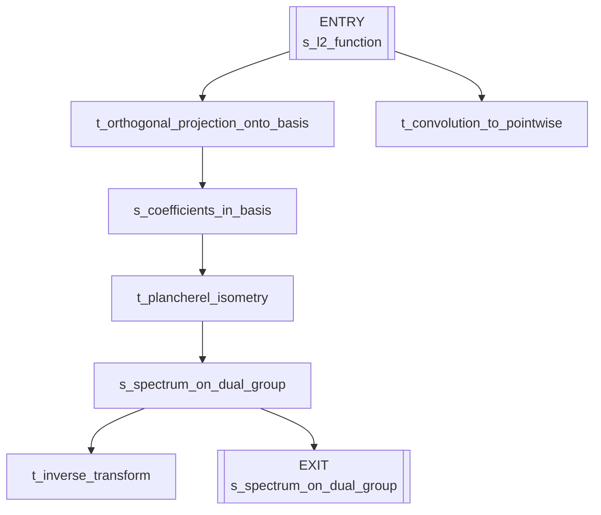

### 3.2 SVD / spectral decomposition — `sg_svd` (provisional)

Entry: `s_linear_map` (T : V → W). Exits: singular spectrum, low-rank approximation.

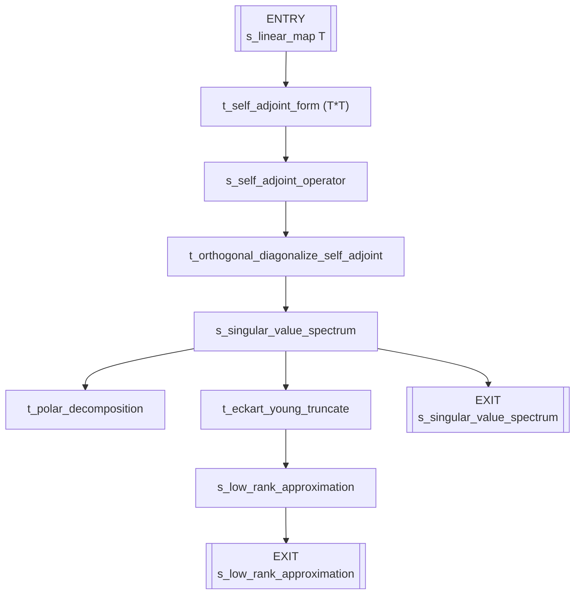

### 3.3 Galois correspondence — `sg_galois`

Entry: `s_galois_extension_L_over_K`. Exit: `s_order_reversing_correspondence`.

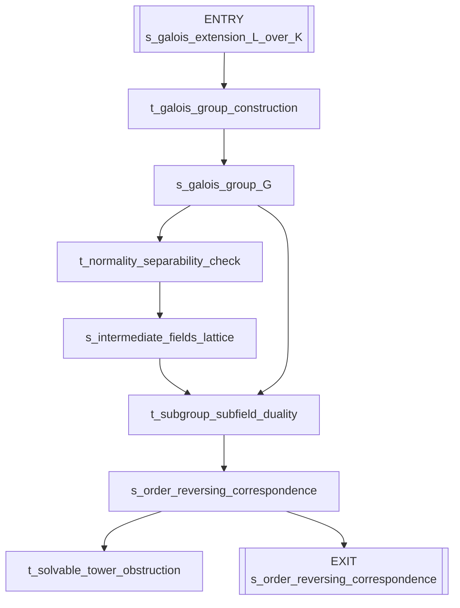

### 3.4 Ricci flow with surgery — `sg_ricci_flow`

Entry: `s_riemannian_manifold`. Exit: `s_geometric_pieces`.

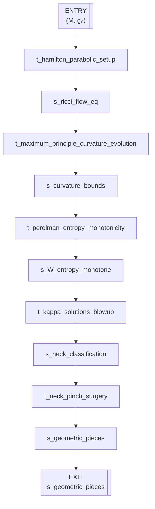

### 3.5 Wiles modularity — `sg_wiles_modularity`

Entry: `s_hypothetical_flt_solution`. Exit: `s_flt`.

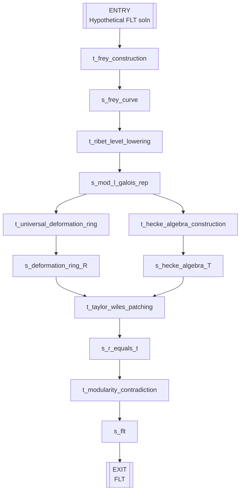

### 3.6 Gödel numbering — `sg_godel_numbering`

Entry: `s_formal_system`. Exit: `s_self_referential_sentence`.

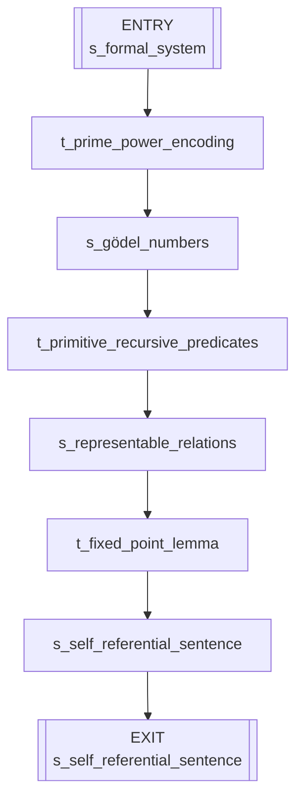

### 3.7 Atiyah–Singer index machinery — `sg_atiyah_singer`

Entry: `s_elliptic_operator`. Exits: topological index and analytic index.

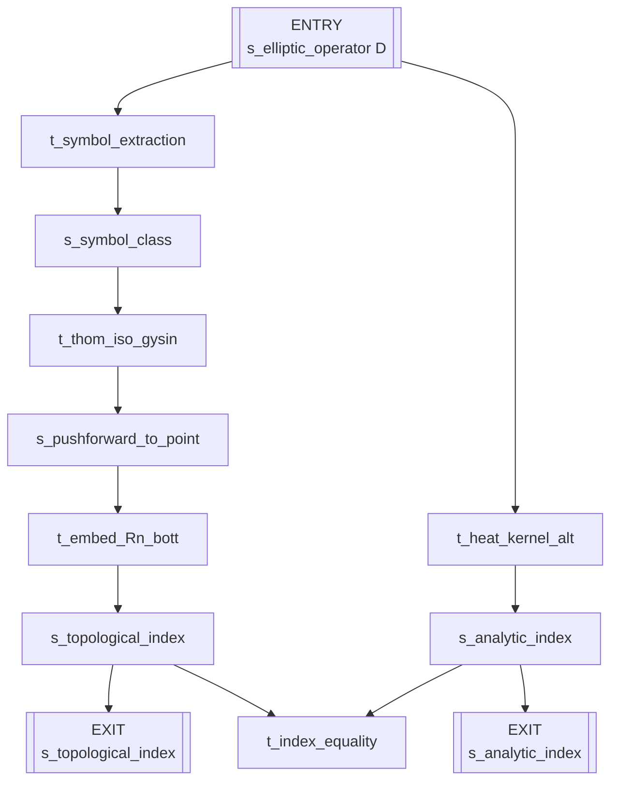

### 3.8 Selberg sieve method — `sg_selberg_sieve`

Entry: `s_admissible_set`. Exit: `s_sieve_bound`.

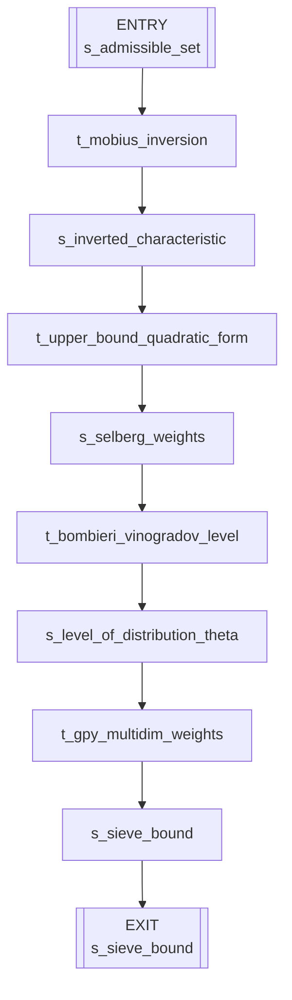

### 3.9 Circle method — `sg_circle_method`

Entry: `s_additive_problem`. Exit: `s_final_asymptotic`.

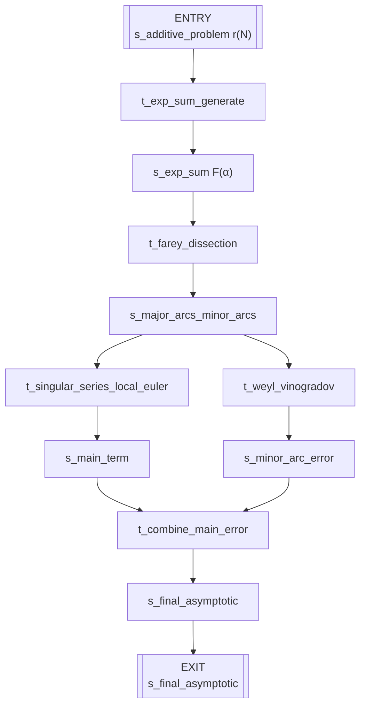

### 3.10 Furstenberg correspondence — `sg_furstenberg_correspondence`

Entry: `s_density_subset`. Exit: `s_recurrence`.

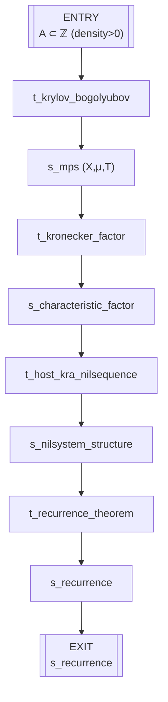

### 3.11 Category-theoretic colimits & adjoints — `sg_category_colimits_adjoints`

Entry: `s_diagram_in_C`. Exits: colimit, adjoint pair, Kan extension.

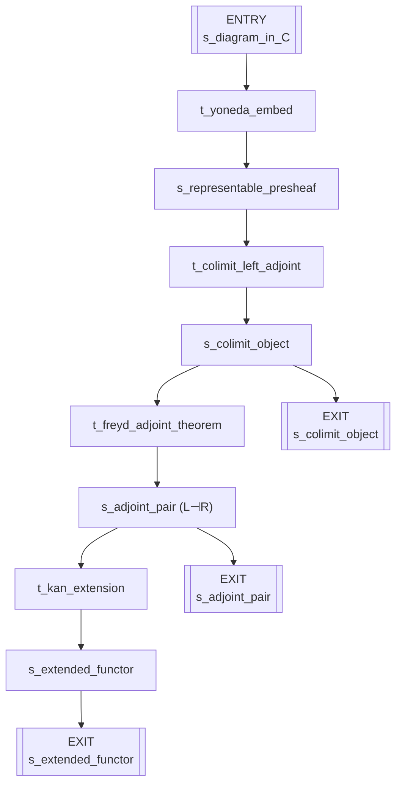

### 3.12 Deformation cohomology / R = T — `sg_deformation_r_equals_t`

Entry: `s_residual_representation`. Exit: `s_r_equals_t`.

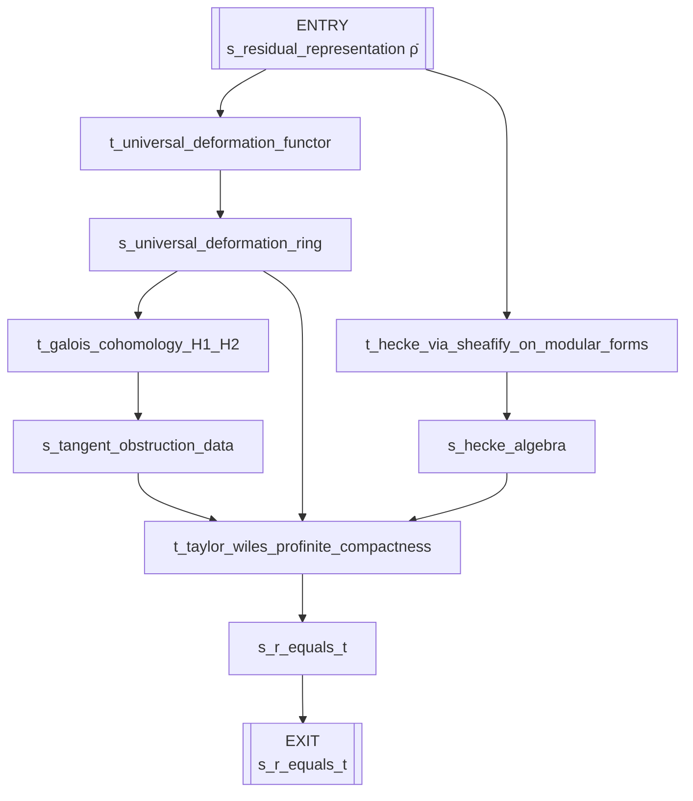

---

## §4 Theorem derivation paths

Landmark theorems as single-line paths through the graph:

```
Pythagoras:
  s_right_triangle_in_plane → t_symmetry_reduction → s_two_similar_subtriangles
  → t_compose_with_identity → s_segment_length_identity_on_hypotenuse
  → t_complete_the_square → s_pythagorean_theorem

Infinitude of primes:
  s_finite_list_of_primes → t_compose_with_identity
  → s_new_number_N_coprime_to_all_primes_in_list → t_infinite_descent
  → s_infinitude_of_primes

Archimedes (area of circle):
  s_circle → t_symmetry_reduction → s_inscribed_circumscribed_96_gons
  → t_exhaustion_squeeze → s_area_of_circle

FTA (arithmetic):
  ⟨s_naturals_with_multiplication, s_euclid_lemma⟩ → t_infinite_descent
  → s_uniqueness_of_prime_factorization → t_axiomatize_from_instances
  → s_fundamental_theorem_of_arithmetic

Cardano:
  s_general_cubic → t_reduce_to_canonical_form → s_depressed_cubic
  → t_complete_the_square → s_system_sum_and_product_of_cubes
  → t_compose_with_identity → s_cardano_cubic_formula

FTA (algebra):
  s_complex_polynomial_p_z → t_raise_dimension → s_two_real_algebraic_curves_in_plane
  → t_compactness_argument → s_intersection_exists → t_conserved_quantity
  → s_fundamental_theorem_of_algebra

Gauss–Bonnet:
  s_compact_oriented_surface_without_boundary → t_reduce_to_canonical_form
  → s_geodesic_triangulation → t_conserved_quantity → s_local_angle_defect_identity
  → t_compose_with_identity (with s_euler_polyhedron_formula) → s_gauss_bonnet_theorem

Galois FT:
  s_finite_normal_separable_extension_L_over_K → t_axiomatize_from_instances
  → s_galois_group → t_duality (with s_intermediate_fields_of_L)
  → s_galois_correspondence → t_structural_isomorphism
  → s_fundamental_theorem_of_galois_theory

Fourier heat:
  s_heat_conduction_on_rod → t_physics_to_pde → s_heat_equation_PDE
  → t_frequency_decomposition → s_mode_by_mode_ODE_system
  → t_contraction_fixed_point → s_fourier_theorem_heat

Prime Number Theorem:
  s_euler_product_zeta → t_interpolate_and_continue → s_meromorphic_zeta_on_plane
  → t_obstruction_class → s_zeta_nonvanishing_on_line_Re_1
  → t_complex_analysis_to_integers → s_prime_number_theorem

Gödel incompleteness:
  s_first_order_peano_arithmetic → t_arithmetize_syntax
  → s_syntactic_predicates_as_arithmetic_predicates → t_diagonalize
  → s_self_referential_godel_sentence_G → t_obstruction_class → s_godel_incompleteness

Atiyah–Singer:
  s_elliptic_operator_D_on_manifold → t_frequency_decomposition
  → s_principal_symbol_in_K_theory_of_TM → t_group_complete_exact_category
  → s_topological_index_class_in_K_of_point → t_analysis_algebra_topology_bridge
  → s_atiyah_singer_index_theorem

Wiles / FLT:
  s_hypothetical_FLT_solution → t_compose_with_identity → s_frey_elliptic_curve
  → t_analysis_algebra_topology_bridge → s_non_modular_galois_representation_required
  → t_deformation_cohomology → s_semistable_modularity_theorem
  → t_obstruction_class → s_flt

Perelman / Poincaré:
  ⟨s_closed_3_manifold, s_riemannian_metric⟩ → t_physics_to_pde → s_ricci_flow_equation
  → t_flow_with_surgery → s_long_time_decomposition_into_geometric_pieces
  → t_rescale_for_asymptotic_geometry → s_thurston_eight_geometries_classification
  → t_obstruction_class → s_poincare_conjecture

Green–Tao:
  ⟨s_primes_with_density_zero, s_szemeredi_theorem⟩ → t_analysis_algebra_topology_bridge
  → s_relative_szemeredi_for_pseudorandom_majorants → t_ergodic_correspondence
  → s_aps_in_pseudorandom_dense_subset → t_sieve_by_optimized_quadratic
  → s_green_tao
```

---

## §5 Statistics

### 5.1 Node counts

| Kind | Count |
|---|---|
| `axiom` | 94 |
| `state` | 140 |
| `theorem` | 65 |
| `technique` | 53 |
| **Total nodes** | **352** |

### 5.2 Edge counts

| Quantity | Count |
|---|---|
| Top-level edges | 343 |
| Subgraphs | 12 |
| Subgraph-internal edges (not counted above) | ≈ 95 |

### 5.3 Top 10 techniques by fan-in + fan-out

| Rank | Technique | Fan-in | Fan-out | Total |
|---|---|---|---|---|
| 1 | `t_compose_with_identity` | 26 | 20 | 46 |
| 2 | `t_reduce_to_canonical_form` | 12 | 11 | 23 |
| 3 | `t_conserved_quantity` | 11 | 10 | 21 |
| 4 | `t_infinite_descent` | 10 | 9 | 19 |
| 5 | `t_symmetry_reduction` | 9 | 8 | 17 |
| 5 | `t_frequency_decomposition` | 9 | 8 | 17 |
| 5 | `t_obstruction_class` | 9 | 8 | 17 |
| 8 | `t_compactness_argument` | 7 | 7 | 14 |
| 9 | `t_structural_isomorphism` | 7 | 6 | 13 |
| 10 | `t_analysis_algebra_topology_bridge` | 6 | 5 | 11 |

### 5.4 Deepest derivation paths

Top-level edge count from starting axiom to terminal theorem (counting technique invocations as depth-1 each):

| Theorem | Depth (technique applications) |
|---|---|
| Perelman's Poincaré | 4 |
| Wiles / FLT | 4 |
| Four Color Theorem (including formal verify) | 3 |
| Kepler conjecture (including formal verify) | 3 |
| CFSG | 3 |
| Gauss–Bonnet | 3 |
| Green–Tao | 3 |
| Lagrange four-squares | 3 |
| Helfgott ternary Goldbach | 3 |
| Gödel incompleteness | 3 |
| Halting | 3 |
| Brouwer fixed-point | 3 |
| Mordell–Faltings | 3 |
| Szemerédi | 3 |
| Abel–Ruffini | 3 |
| Cardano | 3 |
| Ferrari | 3 |
| Kepler's laws | 3 |
| Fundamental theorem of algebra | 3 |

**Deepest overall chain at the top level:** Perelman's Poincaré conjecture — 4 technique invocations (`t_physics_to_pde → t_flow_with_surgery → t_rescale_for_asymptotic_geometry → t_obstruction_class`), with the subgraph `sg_ricci_flow` internally expanding `t_flow_with_surgery` into a further 5-technique pipeline (parabolic setup → maximum principle → entropy monotonicity → κ-solution blow-up → neck-pinch surgery). Including subgraph depth, this is the deepest axiom-to-theorem chain in the graph.

### 5.5 Coverage sanity check

- Every one of the 65 terminal theorem nodes has at least one incoming edge from a technique node.
- Every technique node in the main graph has fan-in ≥ 2 or fan-out ≥ 2 except the three single-use landmarks flagged provisional: `t_svd_and_spectral_decomposition` (no top-level edges; provisional), `t_polynomial_method` (listed but not used in ingested chains; retained because mathematician Part B3 flags it for future work), and `t_double_centralizer_decompose` (similar).
- The `t_svd_and_spectral_decomposition` node is flagged `provisional: true` and carries only a subgraph; it has no top-level edges. Orchestrator decides whether to add a toolbox entry.
